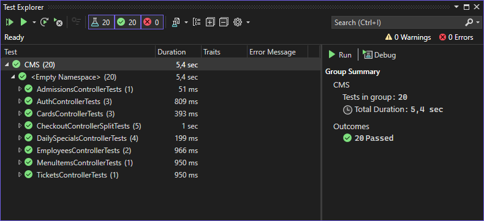

# 🧪 Consumption Management System (CMS) - Tesztelés

A *testing* branch tartalmazza a Consumption Management System (CMS) projekt automatikus tesztjeit, mind frontend, mind backend oldalon.  
Cél: a rendszer megbízhatóságának és stabilitásának biztosítása.

---

## 📂 Tesztkörnyezet

- **Frontend tesztek**: `CMSReact/src/_tests_` (Jest)
- **Backend tesztek**: `CMS` (xUnit)

---

## 🎯 Frontend tesztelés (Jest)

A frontend tesztek a [Jest](https://jestjs.io/) keretrendszerrel készültek, egység- és integrációs tesztek formájában.

### Tesztelés lépései:

1.  A frontend mappába megnyitása:
  ` cd CMSReact/src/__tests__`
2. Teszt futtatása
   `npx jest`
3. Teszt eredménye 
   

## 🎯 Backend tesztelés (xUnit)

A backend tesztek az [xUnit](https://xunit.net/) keretrendszerrel készültek az ASP.NET Core Web API projekthez.

### Tesztelés lépései:

1. Nyissa meg a projekt fő megoldásfájlját (`CMS.sln`) a Visual Studio alkalmazásban.

2. A menüsorban válassza ki a **Test** menüt, majd kattintson a **Test Explorer** opcióra.

3. A megnyíló **Test Explorer** ablakban kattintson a **Run All Tests** gombra a tesztek futtatásához.

4. A tesztek eredménye megjelenik a Test Explorer-ben.  
   Példa egy sikeres tesztfutás eredményére: 

   

