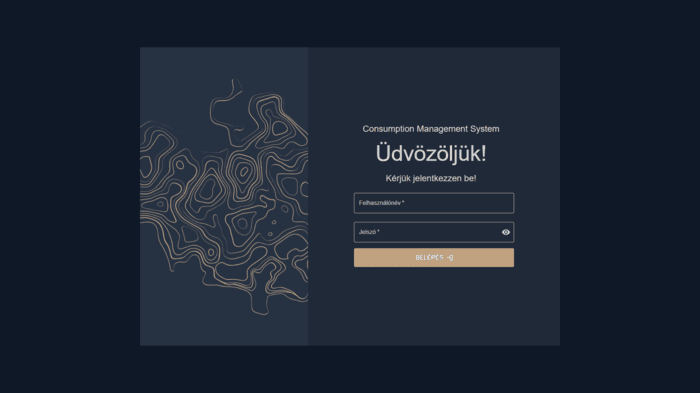

# Consumption Management System (CMS)

A modern, RFID-alapú fogyasztáskezelő rendszer szállodák, fürdők és egyéb szolgáltatóhelyek számára. A rendszer célja a vendégek kényelmes, egy karszalagos azonosításon alapuló fogyasztásának nyomon követése és kezelése.

## Képek

## 📁 Főbb jellemzők

- React + TypeScript frontend, Material UI alapokon
- ASP.NET Core Web API backend
- SQLite adatbázis Entity Framework Core ORM-mel
- JWT alapú hitelesítés és jogosultságkezelés
- Rendelés, jegyvásárlás, napi ajánlat, és fogyasztás-véglegesítés funkciók
- Modern, reszponzív felhasználói felület

## 🧑‍💻 Fejlesztői eszközök

- Visual Studio 2022 (.NET backend)
- Visual Studio Code (React frontend)
- Vite (frontend build és hot reload)
- Postman & Swagger (API tesztelés)
- ESLint, Prettier (kódminőség)
- Tailwind CSS (stílusok)
- Git & GitHub (verziókezelés)

## ▶️ Rendszer futtatása (.exe build esetén)

A rendszer használatához nincs szükség külön fejlesztői környezetre vagy telepítési folyamatra.  
A végleges verzió egyetlen futtatható `.exe` fájlként lett elkészítve, amely tartalmazza mind a backend (szerveroldali), mind a frontend (kliensoldali) komponenseket.

### Indítás lépései

1. **Futtatható fájl megkeresése**  
   Nyissa meg azt a mappát, ahol a `CMS.exe` fájl található.

2. **Rendszer elindítása**  
   Dupla kattintással futtassa a `CMS.exe` fájlt. A megjelenő parancssorban látható lesz, hogy a háttérszolgáltatás az `5000`-es porton elindult.

3. **Használat böngészőn keresztül**  
   Lépjen be a következő címen:  
   [https://localhost:5000](https://localhost:5000)  
   A rendszer azonnal használható, fejlesztői eszközök nélkül is.

## 📄 License

Ez a projekt kizárólag vizsgaremek célokra készült. Nem kereskedelmi forgalmazásra.

---

Created by:  
**Dobosi Gábor**  
**Mák Luca**  
**Orbán Barnabás**
