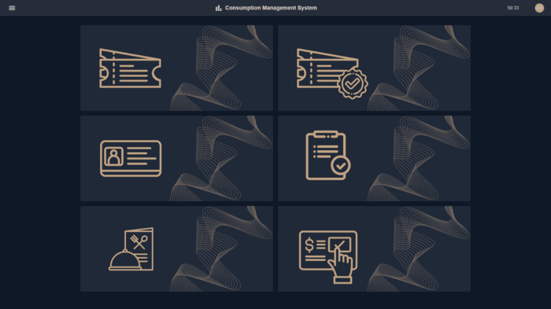
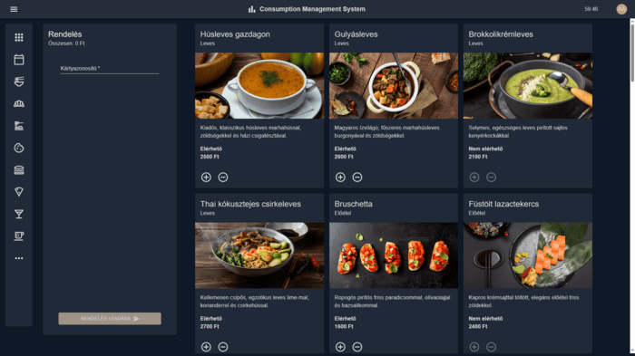
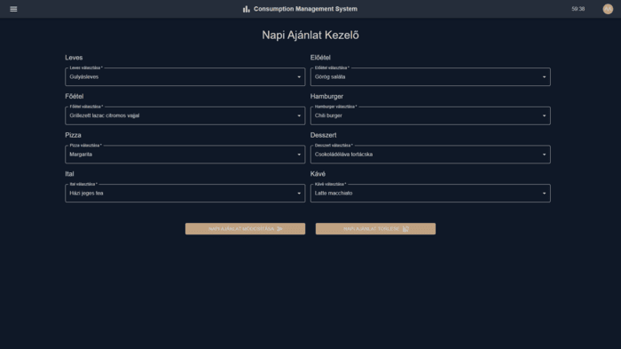

# Consumption Management System (CMS)


Modern, RFID-alapú fogyasztáskezelő rendszer szállodák, fürdők és egyéb szolgáltatóhelyek számára. A rendszer célja a vendégek kényelmes, egy karszalagos azonosításon alapuló fogyasztásának nyomon követése és kezelése.

---

## ▶️ Rendszer futtatása (.exe build esetén)

A rendszer használatához nincs szükség külön fejlesztői környezetre vagy telepítési folyamatra.  
A végleges verzió egyetlen futtatható `.exe` fájlként lett elkészítve, amely tartalmazza mind a backend (szerveroldali), mind a frontend (kliensoldali) komponenseket.

### Indítás lépései

1. **Futtatható fájl megkeresése**  
   Nyissa meg azt a mappát, ahol a `CMS.exe` fájl található.

2. **Rendszer elindítása**  
   Dupla kattintással futtassa a `CMS.exe` fájlt. A megjelenő parancssorban látható lesz, hogy a háttérszolgáltatás az `5000`-es porton elindult.

3. **Használat böngészőn keresztül**  
   Lépjen be a következő címen:  
   [https://localhost:5000](https://localhost:5000)  
   A rendszer azonnal használható, fejlesztői eszközök nélkül is.

## 💻 Rendszer futtatása fejlesztői módban (React + .NET)

A fejlesztői mód lehetővé teszi a rendszer különálló backend és frontend komponenseinek futtatását lokális környezetben.

### 🖥️ Backend indítása (ASP.NET Core)

1. **Navigálj a backend mappához**
   Lépj be a `CMS` mappába, ahol a .NET projekt található.

2. **Függőségek telepítése**
   Futtasd az alábbi parancsot a szükséges csomagok letöltéséhez:
   ```bash
   dotnet restore
   ```

3. **Projekt indítása**
   Nyisd meg a `CMS.sln` fájlt Visual Studio-val, vagy futtasd terminálból:
   ```bash
   dotnet run
   ```
   A backend elérhető lesz a `https://localhost:5000` címen. A böngésző automatikusan megnyitja a Swagger felületet is.

### 🧑‍💻 Frontend indítása (React + Vite)

1. **Navigálj a frontend mappába**
   Lépj be a `CMSReact` könyvtárba:
   ```bash
   cd CMSReact
   ```

2. **Függőségek telepítése (ha szükséges)**
   Amennyiben nincs `node_modules` mappa, telepítsd a függőségeket:
   ```bash
   npm install
   ```

3. **Fejlesztői szerver indítása**
   A frontend fejlesztői mód elindításához használd:
   ```bash
   npm run dev
   ```
   A rendszer ekkor a `http://localhost:5173` címen érhető el.

## 📁 Főbb jellemzők

- React + TypeScript frontend, Material UI alapokon
- ASP.NET Core Web API backend
- SQLite adatbázis Entity Framework Core ORM-mel
- JWT alapú hitelesítés és jogosultságkezelés
- Rendelés, jegyvásárlás, napi ajánlat, és fogyasztás-véglegesítés funkciók
- Modern, reszponzív felhasználói felület

## 💻 Fejlesztői eszközök

- Visual Studio 2022 (.NET backend)
- Visual Studio Code (React frontend)
- Vite (frontend build és hot reload)
- Postman & Swagger (API tesztelés)
- ESLint, Prettier (kódminőség)
- Tailwind CSS (stílusok)
- Git & GitHub (verziókezelés)

## 🖼️ Képek
### Login Page


### Landing Page


### Order Page


### Daily Specials Page


## 📄 License

Ez a projekt kizárólag vizsgaremek célokra készült. Kereskedelmi forgalomba nem hozható.

---

## 🤝 Created by  
- [Dobosi Gábor](https://github.com/dobosig) 
- [Mák Luca](https://github.com/makluca)
- [Orban Barnabás](https://github.com/barnibooo)
